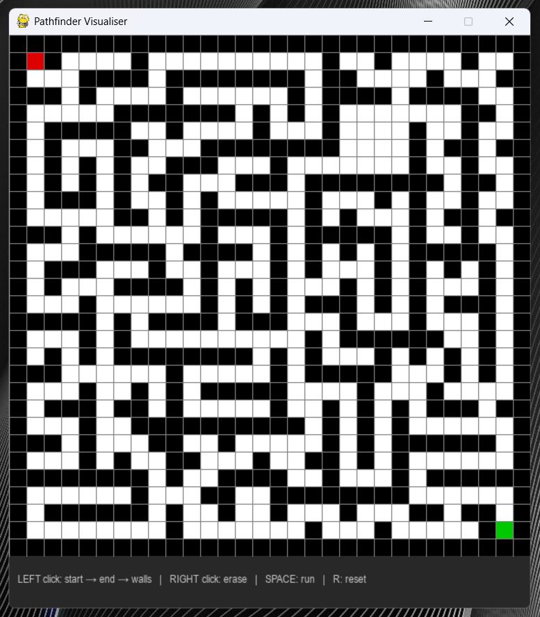

# maze-pathfinding-visualizer
A real time shortest path visualiser with customizable walls, start and end point; Built in Python using Pygame.

## How it works
Uses Breadth-First Search (BFS) to guarantee the shortest path between the start and end point on a grid.
Animates the exploration wave step by step, then traces back the optimal route in yellow.

## Example

## Controls
- Left click: Place Start (green), Then End (red), Then Walls (black)
- Right click: Erase
- SPACE: Run BFS
- R: reset all cells

## Concepts
Graph traversal, Queue Data Structures (FIFO), O(V+E) time complexity, path reconstruction.

## Requirements
- Python 3.11 + Pygame
- pip install pygame
- python pathfinder.py
